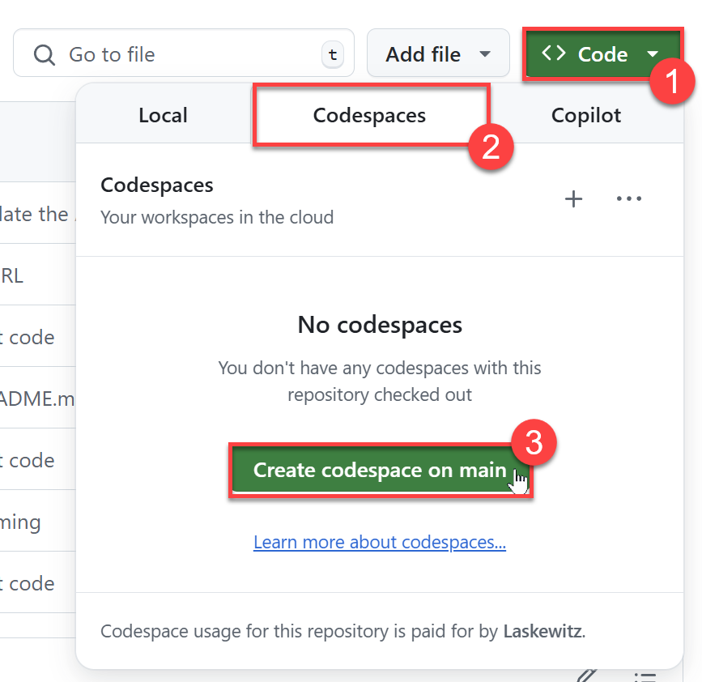

# Jokes MCP Server

Welcome to the Jokes MCP Server! This is a [MCP](https://modelcontextprotocol.io/introduction) server built on the [TypeScript SDK](https://github.com/modelcontextprotocol/csharp-sdk).

With this MCP Server, you will able to fetch jokes from the following websites:
- [chucknorris.io](https://api.chucknorris.io/)
- [icanhazdadjoke.com](https://icanhazdadjoke.com/)

<table>
  <tr>
    <td></td>
    <td></td>
  </tr>
</table>

## Tools

The following tools are included:

### get-chuck-joke

This tool retrieves a random Chuck Norris Joke from [chucknorris.io](https://api.chucknorris.io/).

### get-chuck-categories

This tool retrieves the available categories from [chucknorris.io](https://api.chucknorris.io/).

### get-dad-joke

This tool retrieves a random Dad Joke from [icanhazdadjoke.com](https://icanhazdadjoke.com/).

## Prerequisites

- Azure Subscription (with payment method added)
- Node installed (preferably with NVM)
- Have a GitHub account and be logged in

## Minimal Path To Awesome

There are two parts of deploying this MCP Server:

- Create a new GitHub repository based on the template
- Deploy the Azure Web App and configure it to grab the source from the GitHub repository
- Create the Power Platform Connector
- Add the MCP Server as an action in Microsoft Copilot Studio

### Part 1: Create a new GitHub repository based on the template

1. Select `Use this template`
1. Select `Create a new repository

    

1. Select the right `Owner` 
1. Give it a `Repository name`
1. Optionally you can give it a `Description`
1. Select `Public` (if you want to make the repository publicly available) or `Private` (if you want to keep it private - **RECOMMENDED**)
1. Select `Create repository`

    This will take a little while. After it's done, you will be directed to the newly created repository.

1. Select the green `Code` button
1. Select the `Codespaces` tab
1. Select the green `Create codespace on main` button
 
    

    This will create a codespace and load it. This might take a little while.

TODO: finish the instructions

### Part 2: Deploy the Azure Web App and configure it to grab the source from the GitHub repository

TODO: write the instructions

### Part 3: Create the Power Platform Connector

1. Replace the `host` in the below OpenAPI v2 spec with the host of your web API
1. Go to [https://make.powerapps.com/](https://make.powerapps.com/)
1. Select `More` in the left menu
1. Select the `Discover all` button
1. Under Data, select the `pin icon` next to `Custom connectors` to pin it to the left menu
1. Select `Custom connectors` in the left menu
1. Select `New custom connector`
1. Select `Create from blank`

    

1. Give the connector a name (for instance `JokesMCP`)
1. Select the blue `Continue` button
1. Select the `Swagger editor` toggle
 
    

1. Copy the yaml code from [here](./assets/connector.yml) and paste it into the Swagger editor

### Part 4: Add the MCP Server as an action in Microsoft Copilot Studio
