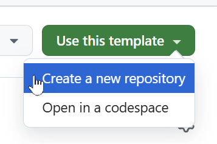
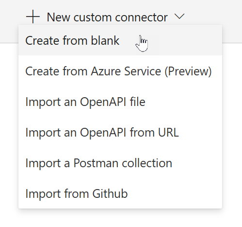

# Using an MCP Server with Microsoft Copilot Studio 🧠🤖

Welcome to the using an MCP Server with Microsoft Copilot Studio lab. In this lab, you will learn how to deploy an MCP Server, and how to add it to Microsoft Copilot Studio.

## What is MCP?

[Model Context Protocol (MCP)](https://modelcontextprotocol.io/introduction) is a standardized interface developed by [Anthropic](https://www.anthropic.com/) that enables external systems to interact with AI models by providing relevant context and receiving responses. In Microsoft Copilot Studio, you can add an MCP Server as a action. MCP Servers can consist of resources, tools and/or prompts. The tools are currently supported in Microsoft Copilot Studio.

## MCP vs Connectors

TODO: Why would you use MCP instead of connectors?

## Prerequisites

- Azure Subscription (with payment method added)
- Node installed (preferably with NVM)
- Have a GitHub account and be logged in

## Minimal Path To Awesome

To be able to deploy this MCP Server and use it in Microsoft Copilot Studio, you need to go through the following actions:

- Create a new GitHub repository based on the template
- Set up the MCP Server as an Azure Web App
- Create the Power Platform Connector
- Add the MCP Server as an action in Microsoft Copilot Studio

### Part 1: Create a new GitHub repository based on the template

1. Select `Use this template`
1. Select `Create a new repository

    

1. Select the right `Owner` 
1. Give it a `Repository name`
1. Optionally you can give it a `Description`
1. Select `Public` (if you want to make the repository publicly available) or `Private` (if you want to keep it private - **RECOMMENDED**)
1. Select `Create repository`

    This will take a little while. After it's done, you will be directed to the newly created repository.

> [!WARNING]  
> After completing the steps in this lab, you will have an MCP Server running on Azure that is publicly available. Ideally, you don't want that. Make sure to delete the Azure Web App after finishing the lab.

### Part 2: Deploy the Azure Web App and configure it to grab the source from the GitHub repository

1\. Go to `portal.azure.com`

2\. Hover over the `Resource groups` tab and select `Create`

3\. Click the `Subscription` dropdown and select your subscription from the list

4\. Click in the `Resource group` name text box and type a resource group name such as "jokesgrp"

5\. Select the `Region` dropdown choose the region closest to you

6\. Click `Review + create`

7\. Click `Create`

8\. Select `Go to resource group`

9\. Select `Create`

10\. Click into the `search box`

11\. Type `web app`

12\. Select the `Create button` in the Web App search result

13\. Select `Web App`

14\. Select the `Name` text input and put in a name for the web app, such as "wegotjokes"

15\. Select the `Runtime stack` dropdown and choose `Node 22 LTS` 

16\. Select the `Region` dropdown and choose the region closest to you

17\. Click `Review + create`

18\. Click `Create`

19\. Click `Refresh` to update your deployment progress

20\. Once deployment is complete, select `Go to resource`

21\. Expand the `Deployment` tab

22\. Click `Deployment Center`

23\. Click the `Source` dropdown and select `GitHub` 

24\. Go to the `Jokes MCP Server Repo` and select `Use this template`

25\. Select `Create a new repository`

26\. Choose your repo as the owner

27\. Enter a `repository name`, such as "aprilgotjokes"

28\. Click `Create repository`

29\. Go back to the Deployment Center in Azure

30\. Select `Authorize`

31\. Select `Continue`

32\. Select `Authorize AzureAppService`

33\. Click the `Organization` dropdown and choose your organization

34\. Click on the `Repository` dropdown and dhoose your GitHub repo from the list

35\. Click the `Branch` dropdown and choose your branch

36\. Keep everything else default and select `Save`

37\. Click `Refresh` to update the deployment status

38\. Verify that the deployment is complete

### Part 3: Create the Power Platform Connector

1. Replace the `host` in the below OpenAPI v2 spec with the host of your web API
1. Go to [https://make.powerapps.com/](https://make.powerapps.com/)
1. Select `More` in the left menu
1. Select the `Discover all` button
1. Under Data, select the `pin icon` next to `Custom connectors` to pin it to the left menu
1. Select `Custom connectors` in the left menu
1. Select `New custom connector`
1. Select `Create from blank`

    

1. Give the connector a name (for instance `JokesMCP`)
1. Select the blue `Continue` button
1. Select the `Swagger editor` toggle
 
    

1. Copy the yaml code from [here](./assets/connector.yml) and replace the code in the Swagger editor
1. Select `Create connector` to create the connector

### Part 4: Add the MCP Server as an action in Microsoft Copilot Studio

TODO: write the instructions

## Jokes MCP Server details

This is a [MCP](https://modelcontextprotocol.io/introduction) server built on the [TypeScript SDK](https://github.com/modelcontextprotocol/csharp-sdk).

With this MCP Server, you will able to fetch jokes from the following websites:
- [chucknorris.io](https://api.chucknorris.io/)
- [icanhazdadjoke.com](https://icanhazdadjoke.com/)
- [yomama-jokes.com](https://www.yomama-jokes.com)

## Tools

The following tools are included:

### get-chuck-joke

This tool retrieves a random Chuck Norris Joke from [chucknorris.io](https://api.chucknorris.io/).

### get-chuck-categories

This tool retrieves the available categories from [chucknorris.io](https://api.chucknorris.io/).

### get-dad-joke

This tool retrieves a random Dad Joke from [icanhazdadjoke.com](https://icanhazdadjoke.com/).

### get-yo-mama-joke

This tool retrieves a random Yo Mama Joke from [yomama-jokes.com](https://www.yomama-jokes.com).